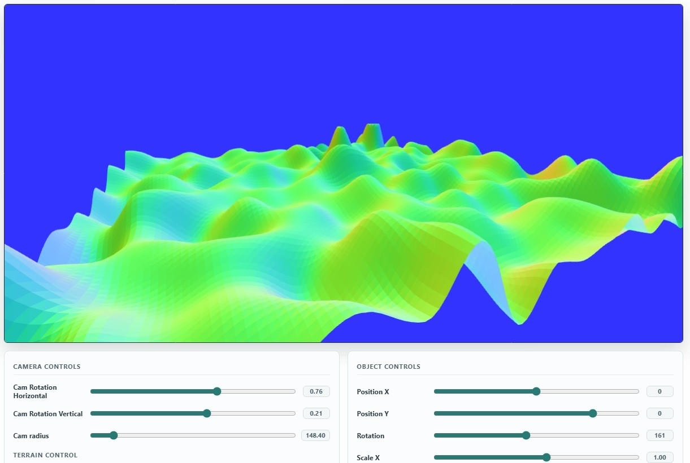

# WebGL Procedural Terrain Generation

An interactive WebGL project built to strengthen my understanding of low-level browser graphics, Perlin noise, and procedural mesh generation. The project began as a renderer for basic WebGL objects, then expanded into noise experiments and finally into a generated terrain surface built from height field data.



## Overview

This project renders a procedurally generated terrain mesh directly in WebGL. Instead of relying on a 3D engine, the rendering pipeline is built from core WebGL concepts: shader compilation, vertex buffers, normal buffers, matrix transforms, camera movement, and dynamic geometry updates.

The terrain is generated from a custom height field. A Perlin-style gradient noise implementation creates repeatable elevation values from a seed, and those values are converted into a triangle mesh that WebGL can render. UI controls allow the terrain and camera to be adjusted live in the browser.

## Why I Built This

I made this project to further develop my WebGL skills and learn how procedural generation works from the ground up. My development process followed a clear progression:

1. Built a basic WebGL renderer that could display transformed 3D objects.
2. Experimented with noise generation techniques and seeded randomness.
3. Connected noise values to height maps.
4. Converted height map data into a procedural triangle mesh.
5. Added interactive controls for camera movement and terrain parameters.

This made the project a practical study in both graphics programming and procedural content generation.

## Features

- Custom WebGL rendering pipeline using raw WebGL APIs
- Procedural height field generated from gradient noise
- Seeded terrain generation for repeatable results
- Multi-octave noise controls for more complex terrain shapes
- Runtime terrain updates when noise settings change
- Triangle mesh generation from height field samples
- Per-triangle normal calculation for normal-based coloring
- Interactive camera rotation and zoom controls
- Object transform controls for position, rotation, and scale
- Separate experimental noise demo for testing noise output before mesh integration

## Technical Highlights

### Procedural Noise

The project includes a custom Perlin-style noise implementation using:

- Seeded pseudo-random number generation
- Random gradient vectors
- Dot products between gradient and distance vectors
- Smooth fade interpolation
- Layered octaves with amplitude and persistence controls

This noise system is used to produce elevation values for terrain vertices.

### Height Field to Mesh Generation

The terrain starts as a 2D grid of sample points. Each point is converted into a 3D vertex where the Y value comes from the procedural height field. The grid is then triangulated into a renderable mesh by connecting neighboring samples into two triangles per cell.

### WebGL Rendering

The renderer handles the graphics pipeline manually:

- Compiles vertex and fragment shaders
- Uploads geometry into position buffers
- Calculates and uploads normal buffers
- Builds model, view, and projection matrices
- Applies camera orbit controls around a look-at point
- Draws the generated mesh with depth testing enabled

## Controls

The browser UI includes controls for:

- Camera horizontal rotation
- Camera vertical rotation
- Camera radius / zoom
- Terrain seed
- Noise amplitude
- Noise persistence
- Noise octaves
- Object position
- Object rotation
- Object scale

Changing terrain settings regenerates the mesh and redraws the scene immediately.

## Project Structure

```text
.
├── index.html                      # Main page and UI controls
├── main.js                         # WebGL setup, render loop, camera, geometry updates
├── gl_shaders.js                   # Vertex and fragment shader source
├── hunter-utils.js                 # Mesh buffer conversion and normal calculation helpers
├── sliders.js                      # Interactive UI control bindings
├── data.js                         # Geometry/color buffer helpers from early WebGL experiments
├── m4.js                           # Matrix math utilities
├── webgl-utils.js                  # WebGL helper utilities
├── procedural/
│   ├── perlin-noise-gen.js         # Gradient noise generation
│   ├── height-fields.js            # Height field classes and terrain elevation logic
│   └── mesh-utils.js               # Grid-to-triangle mesh generation
└── noise-testing/
    ├── perlin.html                 # Standalone noise testing page
    ├── perlin-noise.js             # Noise experimentation code
    └── styles.css
```

## Running Locally

Open `index.html` in a browser that supports WebGL.

If browser security settings prevent local scripts from loading correctly, run a simple local server from the project directory:

```bash
python -m http.server 8000
```

Then open:

```text
http://localhost:8000
```

## Skills Practiced

- WebGL fundamentals
- GLSL shader setup
- Vertex and normal buffers
- 3D matrix transformations
- Perspective projection and camera math
- Procedural noise generation
- Seeded randomness
- Height map generation
- Procedural mesh construction
- Interactive browser-based graphics controls

## Future Improvements

- Add texture mapping based on elevation or slope
- Smooth normals across shared vertices
- Add lighting with directional or point lights
- Add terrain color gradients for water, grass, rock, and snow
- Support larger or adaptive terrain resolutions
- Add screenshot examples and a live demo link


